<div align="center">

# 基金从业刷题

**1673 道带解析的真题押题，按官方教材目录归好类。一个网页，装到手机就能离线刷。**

不用注册，没有会员，做题记录只存在你自己手机里。

### [→ 打开就能用](https://height.github.io/fund-exam/)

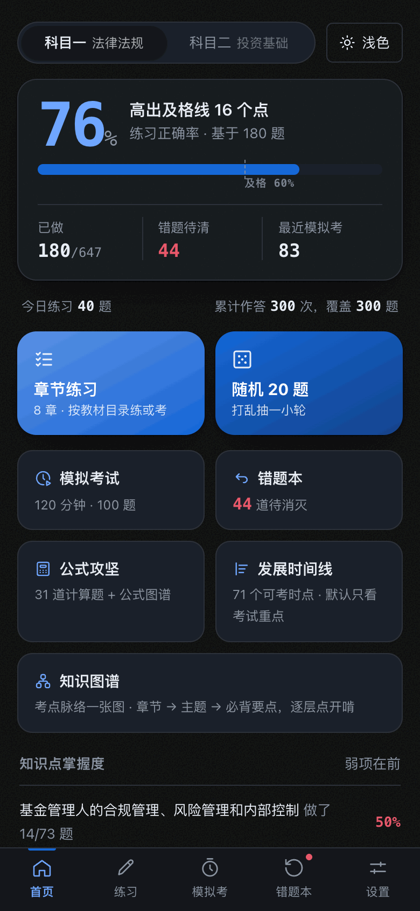
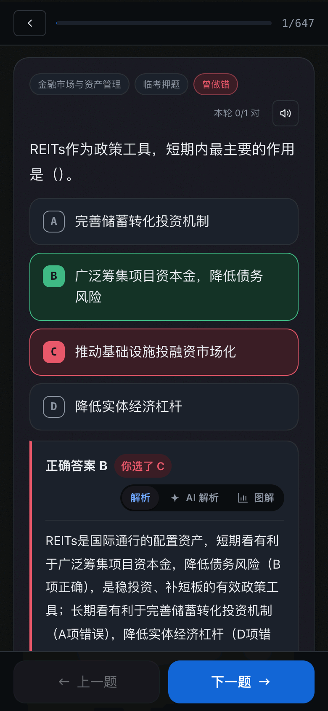
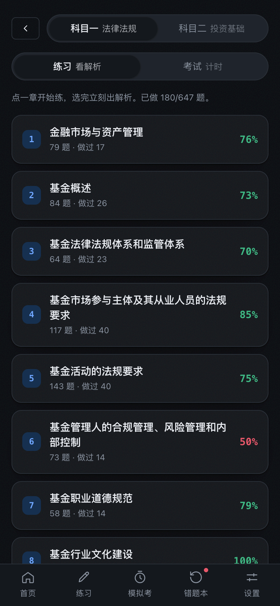

</div>

---

## 对着教材一章一章刷

科目一 8 章、科目二 18 章，跟书上的目录一模一样。
每章多少题、做过多少、正确率多少，一眼看到底。哪章红了就补哪章。

上面切一下就从「练习」变「考试」——单章抽 30 题限时考一遍，
考完就知道这章到底会了没有。

<div align="center">

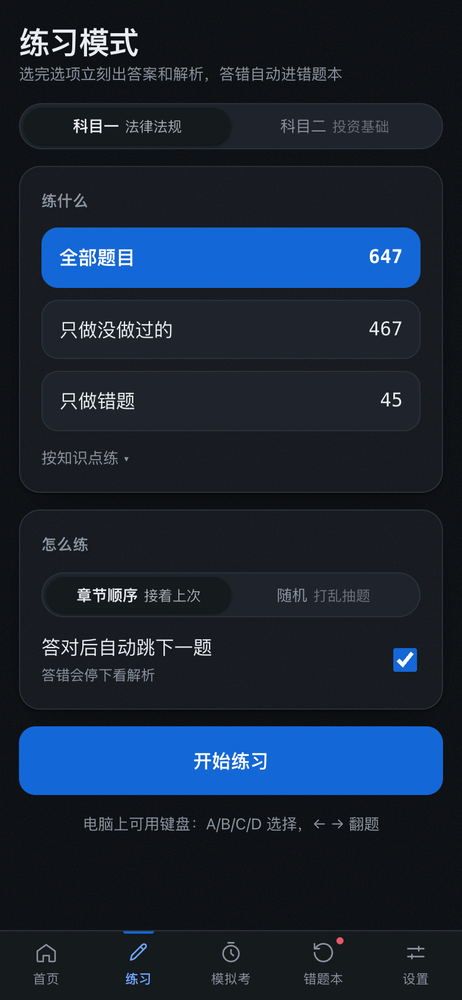
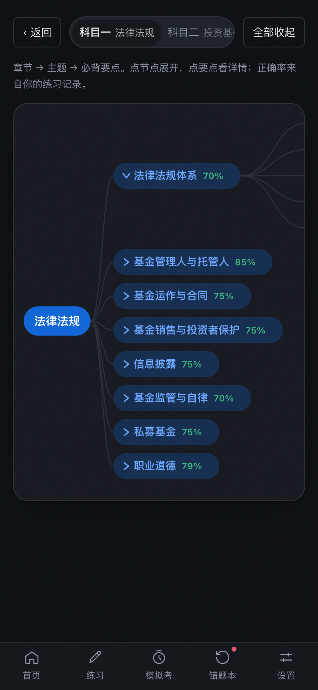
</div>

## 选完立刻出解析

不用等交卷。选错了直接告诉你正确答案是哪个、你错在哪，解析就在下面。
答对可以设成自动跳下一题，答错才停下来。

答错的题自动进错题本，再答对自动移出去。

<div align="center">

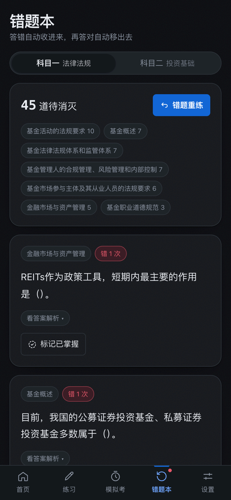
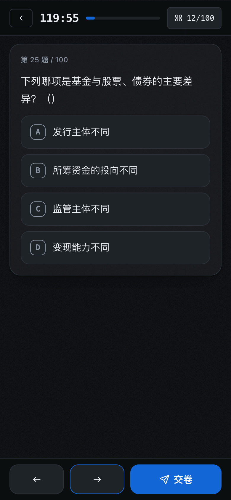
</div>

## 解析看不懂？让 AI 换个讲法

有些解析写得跟法条一样。点一下「AI 解析」，用大白话重讲一遍，
比喻、口诀、易混对比表都有。还能生成一页交互式图解，一步一步点着看。

题目里遇到不懂的词，直接划一下，点「解释」就能只问这一小段，不用自己复制粘贴。

要自己填 Key，DeepSeek / 智谱 GLM / ZenMux 都行，Key 只存在你手机上。
不配也不影响刷题。

<div align="center">
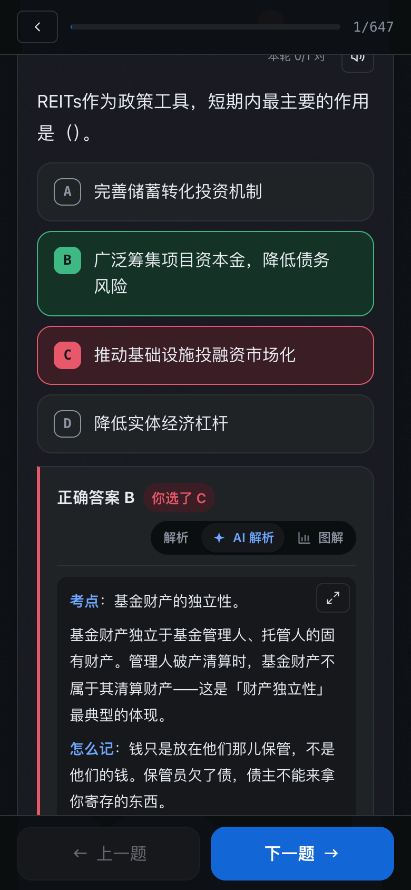
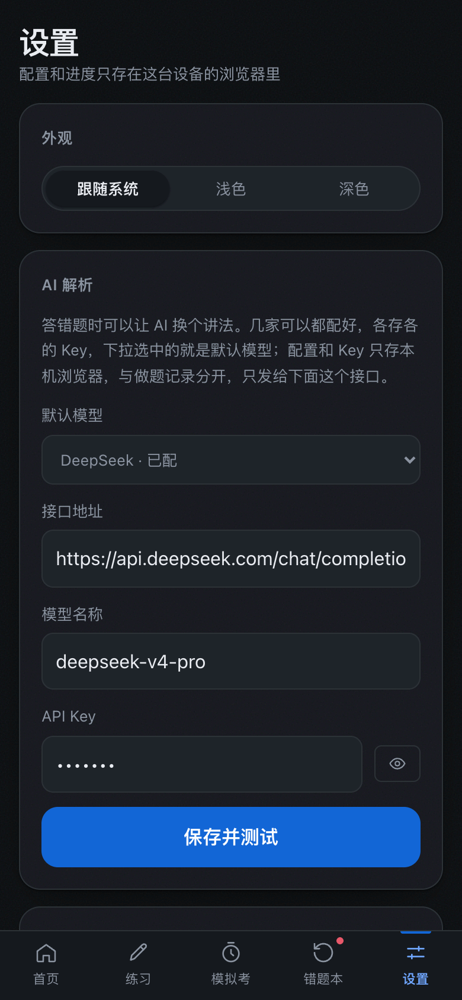
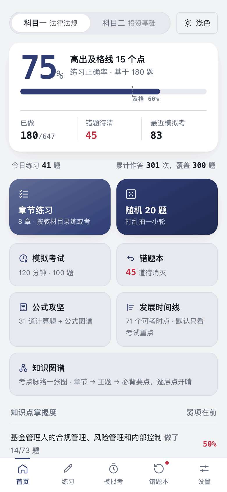
</div>

## 不方便盯屏幕，就听着刷

题目、正确答案、教材解析和 AI 讲解都可以直接朗读。语音边生成边播放，
不用等整段合成完；支持 1× / 1.25× / 1.5× 变速，提速不变调。

语音使用 MiMo TTS，需要在设置里填自己的 Key。已经生成过的最近几段会在当前会话中缓存，
停下重播或翻回上一题时不用重新合成。

## 算不清就叫计算器

科目二有一堆算收益率、算周转天数的题。右下角常挂一个科学计算器，
点开是个抽屉——题目照样能滚能点，边看题边算，算到一半收起来看数字也不会丢。

31 道计算题挑出来单练，配 18 页公式图谱，做错了直接翻。

<div align="center">
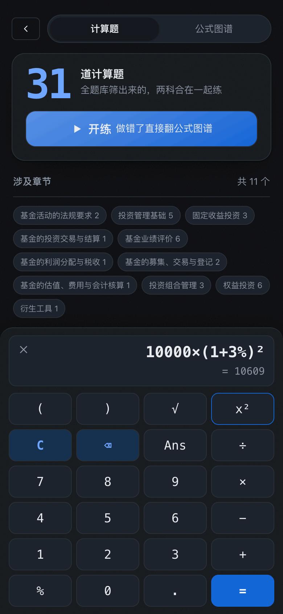
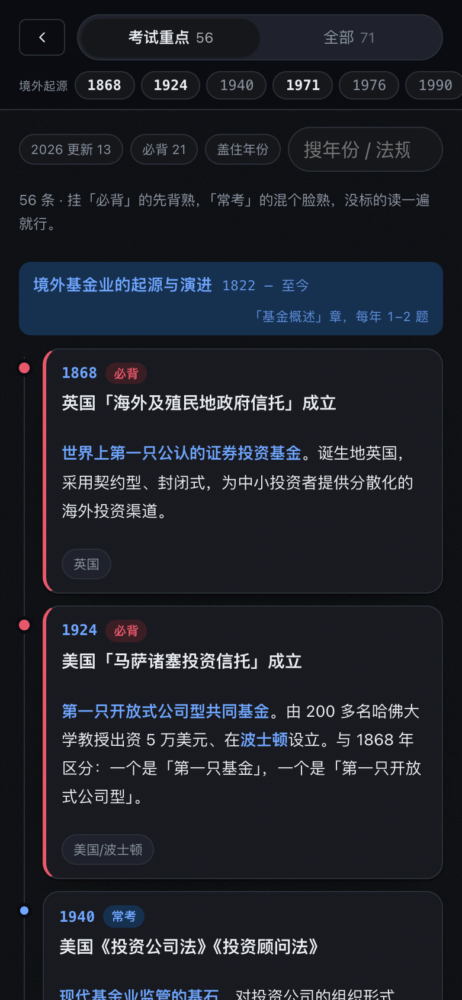

</div>

## 基金发展史，专治年份题

「第一只货币市场基金是哪年」「淄博基金是谁批的」——这种题每年都考，
背起来又乱。1822 年到现在的 71 个时点串成一条线，分「必背 / 常考 / 了解」三档，
默认只显示考试重点。

有个「盖住年份」的开关，把日期全遮起来，自己想完再点开对答案。

<div align="center">


</div>

---

## 题从哪来

1673 道，全部带解析：

| | |
|---|---|
| 科目一 基金法律法规、职业道德与业务规范 | 939 题 |
| 科目二 证券投资基金基础知识 | 734 题 |
| 临考押题 | 692 题 |
| 模考金题 | 336 题 |
| 终极押题 | 198 题 |
| 2026 年 5 月真题 | 149 题 |
| 2025 年 5 月真题 | 149 题 |
| 2025 年 11 月真题 | 119 题 |
| 高频真题 | 30 题 |

重复和高度相似的题会做语义去重——同一个考法即使换了题干措辞或选项顺序，
也只保留一道；优先留下来源更可信、解析更完整的版本。

其中 98 道解析最难懂的另配了大白话版本，折叠在原解析下面，原文一字不改。

**章节是重做过的。** 题目逐题按官方教材目录归位，再经过交叉复核；
新增题目入库时也会校验科目、章节、答案和解析。现在每道题都落在书上真实存在的那一章。

## 装到手机

用 Safari 或 Chrome 打开 [在线地址](https://height.github.io/fund-exam/)，
点分享 → 添加到主屏幕。之后它就是一个 App 图标，点开全屏，断网也能刷。

也可以下载整个 `dist/` 目录离线使用。目前完整目录约 3.5 MB，
其中核心页面打包在约 1.9 MB 的 `index.html` 里，另外包含图标、离线缓存和 18 页公式图谱。

## 本地跑

```bash
npm install
npm run dev      # http://localhost:5173
npm run build    # 打包成单个 dist/index.html
```

## 隐私

- 做题记录、错题、成绩存在浏览器本地，不上传
- 没有账号，没有埋点，没有第三方脚本
- AI 和语音 API Key 存在你自己手机上，只发给你配置的对应接口
- 设置页可以导出进度 JSON，换手机自己搬过去

## 许可

代码 [MIT](LICENSE)。

题库来自第三方备考资料，版权归原作者，仅供个人学习，请勿商用或再分发。
图标来自 [Tabler Icons](https://github.com/tabler/tabler-icons)（MIT），出处见 [NOTICE](NOTICE)。

> 考点数字以中国证券投资基金业协会最新正式文件为准。
