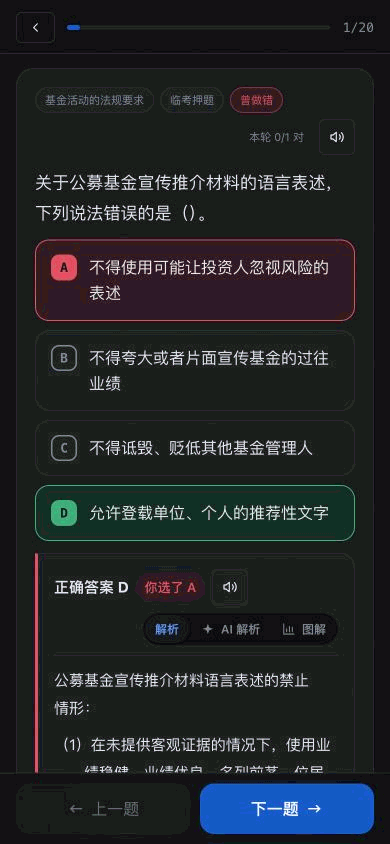
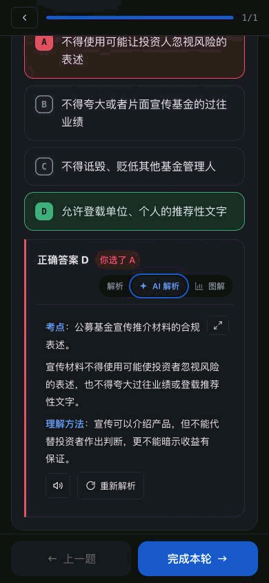
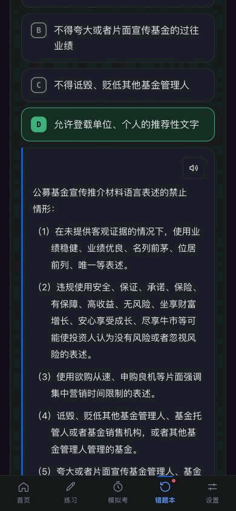
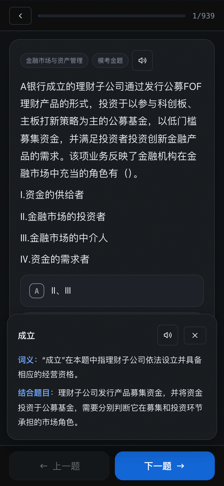

<div align="center">

# 考基宝

### 基金从业考试刷题宝

**从章节学习到错题复习，帮助你学懂考点，并在限时作答中检验掌握程度。**

覆盖科目一、科目二，共 26 章、1645 道可练习题目，提供解析、公式微课和模拟考试。
无需注册，不设会员功能，学习记录保存在本地浏览器中。

### [开始使用考基宝](https://height.github.io/fund-exam/)


</div>

---

## 产品定位

考基宝面向自主备考基金从业考试的人，帮助你把复习时间用在尚未掌握的考点上。
复习过程中，你需要知道哪些内容还没学、一道题为什么做错，以及离开提示后能否独立完成。
章节进度、题目解析、错题复习和限时模拟分别服务于这些判断。

刚开始复习，可以从章节练习建立知识框架；已有基础，可以先做一套模拟考定位薄弱章节。
做错后结合解析补概念，遇到列式困难进入公式微课，再回到题目独立作答。
临考前用限时模拟检查答题速度与正确率，据此安排下一轮复习。

## 按教材章节练习

考基宝按照官方教材目录整理题库，覆盖科目一 8 章、科目二 18 章。
章节页展示题量、已练题数和正确率，便于定位尚未覆盖或正确率偏低的章节。

每章均支持练习和考试两种模式。章节考试随机抽取最多 30 题，
并按照正式考试的每题用时比例设置倒计时。

<div align="center">


</div>

## 即时解析与错题管理

练习模式下，提交选项后立即显示正确答案和题目解析，无需等待整组练习结束。
可启用答对后自动进入下一题，答错时保留当前页面以便查看解析。

答错的题目会自动加入错题本；在后续练习中答对后，自动从错题本移除。

<div align="center">


</div>

## AI 辅助解析

对于不易理解的教材解析，可调用 AI 生成补充说明，包括概念解释、易混点对比和记忆提示。
应用也支持生成独立的交互式图解，用于梳理题目中的概念关系。

选中题目或解析中的文字后，可通过「解释」功能仅针对所选内容发起查询。

该功能需要自行配置 API Key，目前预设 DeepSeek、智谱 GLM 和 ZenMux，
也可修改接口地址及模型名称。未配置时不影响题库、练习和考试功能。

<div align="center">


</div>

## 题目表述拗口时，试试语音朗读

遇到题干较长、表述复杂或不易断句的题目时，可以通过语音朗读辅助理解。
题目、正确答案、教材解析和 AI 补充说明均支持朗读。
音频采用流式生成和播放，支持 0.75×、1×、1.25×、1.5× 和 2× 语速，
并在变速时保持音调稳定。

语音功能使用 MiMo TTS，需要在设置页配置相应的 API Key。
最近生成的音频会在当前会话中缓存，重复播放时无需再次合成。

| 题目与教材解析 | AI 解析 |
|---|---|
|  |  |
| **错题本解析** | **划词解释** |
|  |  |

## 公式攻坚微课堂与计算题

公式攻坚提供六节老师带练式微课：收益金额、持有期收益率、单利与复利、复利现值、组合加权收益和概率期望。
每节先用具体数量和可操作图解建立关系，再过渡到中文算式与字母公式，最后独立列式、计算并迁移到新情境。

新课包含 108 道明确标注的自编测评题、12 道带练题和可跳过的四道基础诊断。提示、看答案或答错后修正只计练习；
三项能力独立通过后，24 小时后用新题复查，才记录为“已巩固”。进度保存在本机，支持刷新续学、导入导出及离线学习。
教学效果仍待目标基础的真人试学验证。

原 47 组公式和变体继续提供查阅，旧勾选保留为历史记录。部分课程可直接进入核对过的科目二题库定向练习；
普通题库答题记录与新课能力记录分别保存。科目二练习页和微课堂均可使用可收起的科学计算器。

课程结构、测试方法及真人试学记录表见 [微课堂说明](docs/formula-classroom.md)。

## 基金业发展时间线与知识图谱

基金业发展时间线收录自 1822 年至今的 71 个可考时点，
按「必背」「常考」「了解」三个层级整理，默认展示考试重点。

「隐藏年份」功能可用于自测。知识图谱则按照“章节—主题—必背要点”的层级组织内容，
并结合本地练习记录展示章节正确率。

<div align="center">


</div>

---

## 题库说明

题库按官方教材章节组织，方便从一道错题回到对应知识点继续复习。当前可练习题均有解析：

| 科目 | 章节 | 可练习题量 |
|---|---:|---:|
| 科目一：基金法律法规、职业道德与业务规范 | 8 | 924 |
| 科目二：证券投资基金基础知识 | 18 | 721 |

题目来自第三方备考资料，包括历年真题整理、模考和押题资料，不是协会官方审定题库。
“真题”等标签沿用资料来源，不代表对命中考试或答案准确性的保证。

题目应当能独立作答，所需案例和表格随题呈现。归类按主考点确定；相似题会复核条件和选项，
保留有学习价值的变式及跨科覆盖。部分题目另有通俗补充说明，帮助理解概念和易混点。

缺少条件或无法确认唯一答案的题目暂停进入练习和考试。题面、答案发生实质修订时，
受影响的旧作答留档，不再计入新版正确率和掌握度，避免把题目问题当成你的知识薄弱项。
审查不能保证题库没有遗漏，法规与考点口径仍应结合官方教材和正式文件核对。
具体依据见[题库质量记录](docs/quality/2026-09-08-整体优化复核.md)与[内容及归类记录](docs/quality/2026-09-08-teammate-review.md)。

## 安装与离线使用

使用 Safari 或 Chrome 打开[考基宝](https://height.github.io/fund-exam/)，
通过浏览器菜单选择“添加到主屏幕”即可作为 PWA 使用。首次加载并完成缓存后，支持离线访问。

也可以下载完整的 `dist/` 目录进行本地部署。当前目录约 3.5 MB，
核心页面打包在约 1.9 MB 的 `index.html` 中，其他文件包括应用图标、Service Worker 和公式图谱。

## 本地开发

```bash
npm install
npm run dev      # http://localhost:5173
npm run build    # 题库质量校验并构建到 dist/
npm run test:quality  # 题库、材料和历史记录迁移回归
npm run audit:questions  # 章节覆盖及相似题候选（不自动删题）
npm run repair:questions # 按已复核清单重放修订，拒绝覆盖未知新改动
```

## 数据与隐私

- 做题记录、错题和考试成绩保存在浏览器本地，不上传至应用服务器
- 考基宝不提供账号系统；启用统计的线上构建只发送匿名页面与功能使用事件，可在设置页关闭
- 匿名统计不包含题目、答案、正确率、考试成绩、AI 内容或 API Key；会话回放和自动点击采集均关闭
- AI 与语音 API Key 保存在本地，仅在调用用户配置的相应接口时发送
- 练习进度可导出为 JSON 文件，并在其他设备或浏览器中导入

## 许可

代码 [MIT](LICENSE)。

题库来自第三方备考资料，版权归原作者，仅供个人学习，请勿商用或再分发。
图标来自 [Tabler Icons](https://github.com/tabler/tabler-icons)（MIT），出处见 [NOTICE](NOTICE)。

> 考点数字以中国证券投资基金业协会最新正式文件为准。
